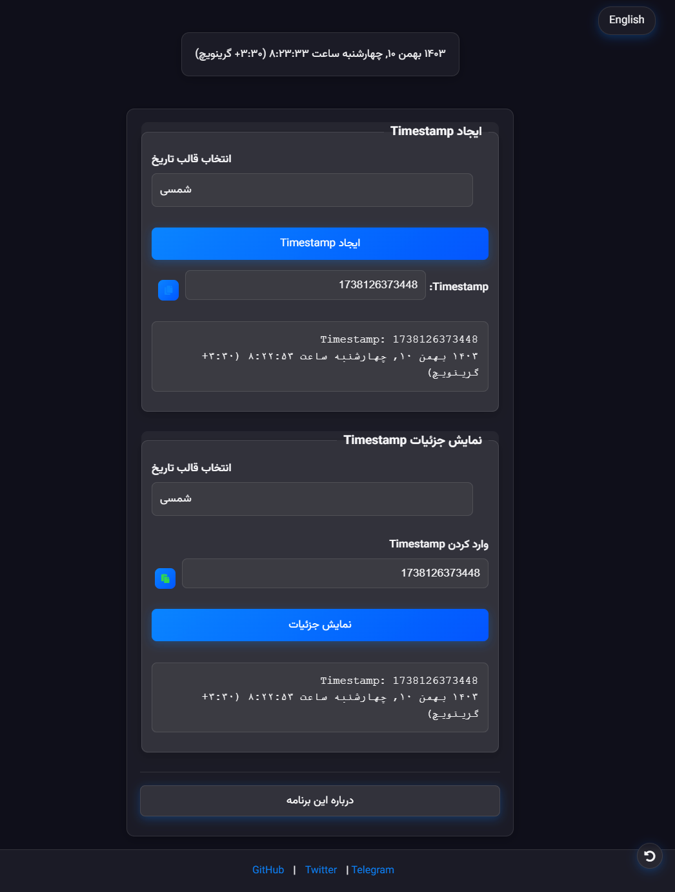

# 
⏱️ TimeSzan - مبدل زمان حرفه‌ای

  

  <a href="https://timeszan.netlify.app">
    مشاهده دموی آنلاین برنامه
  </a>

  یک ابزار ساده و کارآمد برای تبدیل و مدیریت Timestamp.

---

## ✨ ویژگی‌ها

* **ایجاد Timestamp:** به سرعت Timestamp لحظه‌ای را تولید کنید.
* **تبدیل Timestamp به تاریخ:** جزئیات تاریخ و زمان مربوط به یک Timestamp را مشاهده کنید.
* **پشتیبانی از تقویم شمسی و میلادی:** نمایش تاریخ‌ها در هر دو تقویم.
* **رابط کاربری زیبا و کاربرپسند:** طراحی مدرن و آسان برای استفاده.
* **کپی و پیست آسان:** به راحتی Timestamp را کپی و پیست کنید.
* **نمایش زمان زنده:** نمایش زمان جاری به صورت لحظه‌ای.

## 🚀 استفاده

1. برای **ایجاد Timestamp**:
   - به بخش "ایجاد Timestamp" بروید.
   - قالب تاریخ مورد نظر خود را انتخاب کنید (شمسی یا میلادی).
   - روی دکمه "ایجاد Timestamp" کلیک کنید.
   - Timestamp ایجاد شده و جزئیات آن نمایش داده می‌شود.

2. برای **نمایش جزئیات Timestamp**:
   - به بخش "نمایش جزئیات Timestamp" بروید.
   - قالب تاریخ مورد نظر خود را انتخاب کنید (شمسی یا میلادی).
   - Timestamp مورد نظر خود را در فیلد "وارد کردن Timestamp" وارد کنید.
   - روی دکمه "نمایش جزئیات" کلیک کنید.
   - جزئیات تاریخ و زمان مربوط به Timestamp نمایش داده می‌شود.

## 🛠️ فناوری‌های استفاده شده

* HTML
* CSS
* JavaScript

## 📄 لایسنس

استفاده از این پروژه رایگان است، اما تحت شرایط زیر:

* **ذکر نام:** در صورت استفاده از این کد یا بخشی از آن، لطفاً نام برنامه **TimeSzan** و توسعه‌دهنده **Ham3ds** را به همراه لینک برنامه ([https://timeszan.netlify.app](https://timeszan.netlify.app)) ذکر کنید.
* **استفاده غیر تجاری و تجاری:** استفاده از این پروژه هم برای مقاصد غیرتجاری و هم تجاری مجاز است.

[Ham3ds](https://github.com/Ham3d-s)

---

# 
⏱️ TimeSzan - Professional Time Converter

  

  <a href="https://timeszan.netlify.app">
    View Online Demo
  </a>

  A simple and efficient tool for converting and managing Timestamps.

---

## ✨ Features

* **Generate Timestamp:** Quickly generate the current timestamp.
* **Convert Timestamp to Date:** View date and time details corresponding to a timestamp.
* **Persian and Gregorian Calendar Support:** Display dates in both calendars.
* **Beautiful and User-Friendly Interface:** Modern and easy-to-use design.
* **Easy Copy and Paste:** Easily copy and paste timestamps.
* **Live Time Display:** Real-time display of the current time.

## 🚀 Usage

1. To **Generate Timestamp**:
   - Go to the "Generate Timestamp" section.
   - Select your desired date format (Persian or Gregorian).
   - Click the "Generate Timestamp" button.
   - The generated timestamp and its details will be displayed.

2. To **Show Timestamp Details**:
   - Go to the "Show Timestamp Details" section.
   - Select your desired date format (Persian or Gregorian).
   - Enter your timestamp in the "Enter Timestamp" field.
   - Click the "Show Details" button.
   - The date and time details corresponding to the timestamp will be displayed.

## 🛠️ Technologies Used

* HTML
* CSS
* JavaScript

## 📄 License

Use of this project is free, but under the following conditions:

* **Attribution:** If you use this code or part of it, please credit the program name **TimeSzan** and the developer **Ham3ds**, along with a link to the program ([https://timeszan.netlify.app](https://timeszan.netlify.app)).
* **Non-commercial and Commercial Use:**  Use of this project is permitted for both non-commercial and commercial purposes.

[Ham3ds](https://github.com/Ham3d-s)

